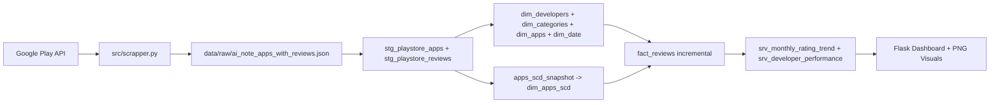
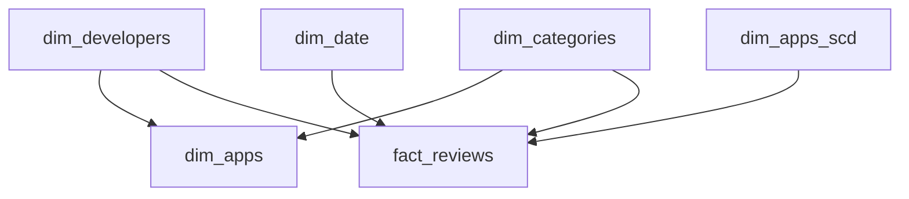

# Lab 2 - dbt + DuckDB Architecture

This README describes the final architecture implemented in this project for Lab 2.

## 1) End-to-End Architecture

## 2) Star/Snowflake View (Implemented)

## 3) Important Notes

- `fact_reviews` is **incremental** with `unique_key = review_id`.
- `apps_scd_snapshot` + `dim_apps_scd` implement **SCD Type 2**.
- dbt tests cover:
  - key uniqueness and non-null checks,
  - FK relationships across dimensions and facts,
  - domain checks on `rating_score`.
- Consumption outputs include:
  - serving tables (`srv_monthly_rating_trend`, `srv_developer_performance`),
  - interactive Flask dashboard,
  - PNG visuals (`images/`).
